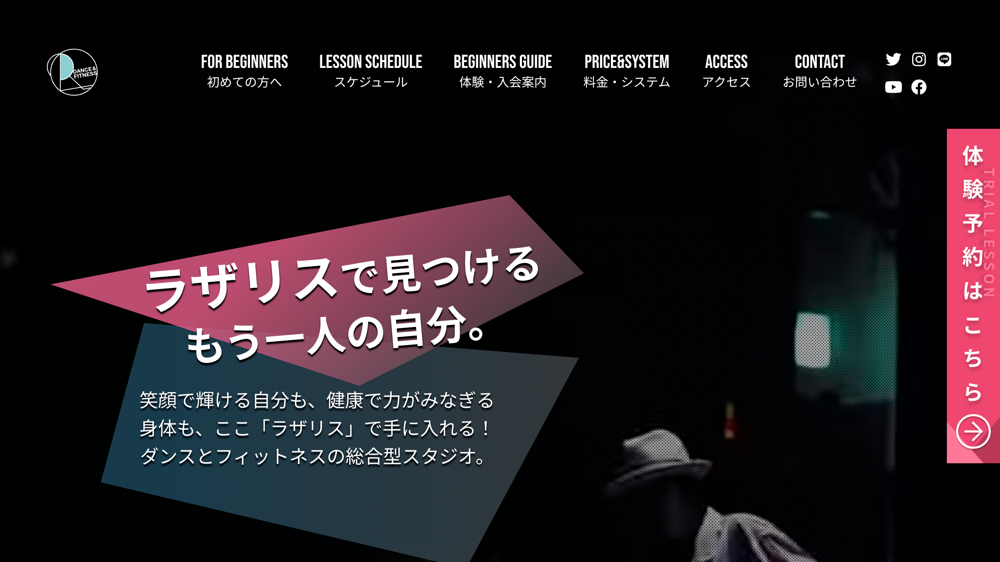

# 株式会社サイバーエージェント

アメブロ専属スタッフとして入社。 芸能人・有名人のブログを月100人という異常なペースでリリースしていました。（累計約2400人のリリース）  
デザインテンプレートを大量に制作しリリーススピードを上げるよう工夫しました。  
また、画像をカルーセル化・非同期化することによりPV増加に貢献しました。

その後、徐々に新規サービスに携わらせていただけるように。  
アジャイルでの少人数チームの制作、良いアイディアがあれば即実行のフットワークの軽さが熱かったです。

## 芸能人・有名人アメーバブログ

* [https://ameblo.jp/momo-minbe/](https://ameblo.jp/momo-minbe/)
* [https://ameblo.jp/tanaka--miho/](https://ameblo.jp/tanaka--miho/)
* [https://ameblo.jp/teriyakiblog/](https://ameblo.jp/teriyakiblog/)
* 芸能人、有名人オフィシャルブログの制作
  * 累計約2400人のオフィシャルブログのリリースを担当
  * テンプレートを大量に制作し、リリーススピードを上げる
  * 画像の読み込みをカルーセルで非同期に処理することによりPVの底上げ
* デザイン
* CMS上でのコーディング
* 運用
* タレントさんとの折衝、ディレクション

## Ameba（アメーバ） \| 芸能人・有名人ブログ

* [https://official.ameba.jp/](https://official.ameba.jp/)
* 芸能人・有名人ブログのポータルページ
* デザインや運用、新規ページの作成を担当

## Ameba News \[アメーバニュース\]

![Ameba News \[&#x30A2;&#x30E1;&#x30FC;&#x30D0;&#x30CB;&#x30E5;&#x30FC;&#x30B9;\]](../.gitbook/assets/image%20%2817%29.png)

* [https://news.ameba.jp/](https://news.ameba.jp/)
* 芸能人・有名人関連のニュースサイト
* デザインや運用、新規ページの作成を担当

## その他、作ったけど流行らなかったもの

### amebloface

* 顔認識により芸能人の顔写真のみを集めて見ることができるサイト

### しゃべり場を探す \| Ameba\(アメーバ\) スマホ写真でおしゃべり センスフル

* 画像をアップロードして、そこからのコミュニケーションを楽しむサイト
* お題からの画像アップロードで、bokete的な盛り上がりも

### Ameba有名人ショップ

* 芸能人・有名人の別注コラボアイテム専門のECサイト

 

